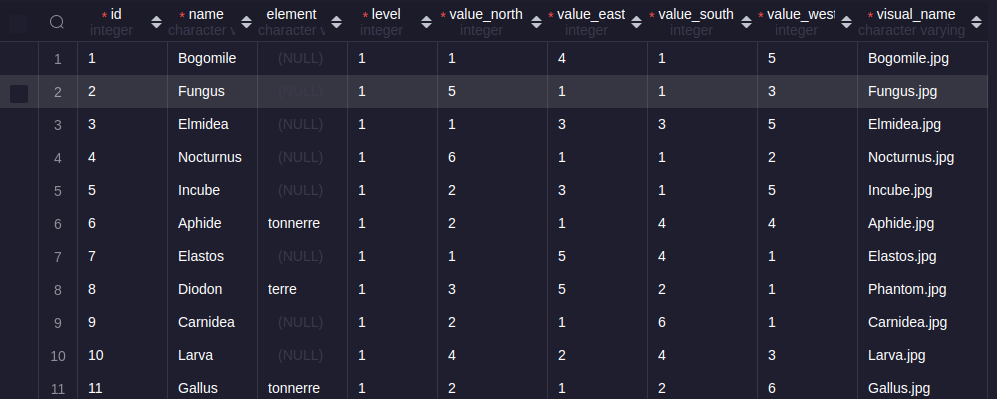

# Feedback 2

## ÉTAPE 0

Bonne analyse du code, tu as bien structuré ton projet.

## ÉTAPE 1

Bonne utilisation des routes paramétrées, tu as bien compris le principe. La conversion en nombre est une bonne pratique.

il te manque l'affichage des valeurs des cartes. Tu les récupères bien via ton datamapper , mais tu ne les affiches pas dans la vue `card.ejs`.

côté datamapper :

Attention aux require :

```js
const client = require('./database');

const database = require('./database');
```

Tu as un doublon ici. C'est comme initié 2 variables pour leurs assigner la même valeur.
tu aurais pu garder `database`.

```js
  async getOneCard (id) {
    const selectQuery = 
      `
      SELECT *
      FROM "card"
      WHERE "id" = ${id}
      `
    ;
    const cardResults = await client.query(selectQuery);

    if (cardResults.rowCount === 1){
      return cardResults.rows[0];
    } else {
      return null;
    }
   
  }
```

Ta requête est correcte. Pour plus de sécurité il vaut mieux faire une requête préparée. Dans ton cas tu passe directement l'id. Ici ça ne pose pas trop de problème car dans ton controller tu converti l'id en nombre. Mais dans le cas ou tu ne le ferais pas, tu pourrais avoir des problèmes de sécurité, notamment avec les injections SQL.

De plus ta condition n'est pas nécessaire, renvoyer` cardResults.rows[0]` suffit. Soit tu as un résultat et il sera renvoyé soit tu n'en a pas et `cardResults.rows[0]` sera `undefined`. Il te suffira dans le controller de vérifier si la valeur est `undefined` ou non et afficher un message d'erreur le cas échéant. N'oublie pas le controller est le chef d'orchestre.


## ÉTAPE 2

 Techniquement ce que tu as fait fonctionne pour la recherche par élement. Cependant l'utilisateur ne peux pas voir les cartes qui n'ont pas d'élement. Pourquoi ?

 

 comme tu peux le voir sur l'image. Dans la base de données certains monstres n'ont aucune valeur dans le champs `element`. Un utilisateur peux faire une recherche par élément, mais il doit aussi pouvoir accéder aux cartes qui n'ont pas d’élément.

 dans ton datamapper tu fais une requête pour récupérer toutes les cartes dont le champs `element` ***n'est pas*** `null`. Via cette requête tu élimines d'office les cartes qui n'ont pas d’élément.

Ensuite dans ton controller tu filtres les cartes en fonction de l’élément. Mais comme tu n'as pas les cartes qui n'ont pas d’élément, tu ne peux pas les afficher.

Si l'utilisateur veux voir les cartes qui ont pour `element`  null. Le `filter` de ton tableau ne trouvera aucune donnée et renverra un tableau vide.

Tu as mis des consoles logs dans ton code, c'est une bonne pratique. Tu peux voir que dans ton controller tu n'as pas de cartes à afficher lorsque l'utilisateur choisi ***aucun***.

Sache tout d'abord que les recherches via SQL seront plus rapide que les recherches via JS. Donc si tu peux faire une recherche via SQL, il vaut mieux le faire.

Ici le but était de faire une requête SQL selon 2 cas de figure:

- Si l'utilisateur veux voir les cartes qui n'appartiennent à aucun élement, on fait une requête SQL qui récupère les cartes dont le champs `element` est `null`. 
  Le piège ici est que `null` n'est pas une valeur, c'est l'absence de valeur. Donc pour faire une requête SQL qui récupère les cartes dont le champs `element` est `null` il faut faire `WHERE "element" IS NULL`.

- Si l'utilisateur veux voir les cartes qui appartiennent à un élement, on fait une requête SQL qui récupère les cartes dont le champs `element` est égal à l'élement choisi.
## ÉTAPE 3

### 3.1 Activer les sessions

Tu as bien mis en place les sessions. La propriété `secret` contient la clé de chiffrement. On ne la met pas dans le code, mais plutôt dans une variable d'environnement. Comme pour le port du serveur ou l'url de la base de données, tu peux utiliser `process.env` pour récupérer la valeur de la clé.

```env

SECRET=maSuperClé5ecret
```

```js
require('dotenv').config()

console.log(process.env.SECRET) // maSuperClé5ecret
```

### 3.2 Ajouter une carte au deck

 L'ajout de carte fonctionne bien. Tu as bien mis la condition pour ne pas avoir de doublons dans le deck. Tu as été très généreux, on peut rajouter plus que 5 cartes.

 Une petite condition pour s'assurer que le deck ne dépasse pas 5 cartes et c'est bon.

### 3.3 Une page pour visualiser le deck

Super, on a bien la page et on voit les cartes de notre deck.

### 3.4 Supprimer une carte du deck

 On ne peux pas supprimé de deck ? Condamné à avoir le même deck jusqu'à la fin des temps ?

 

## Conclusion

 Bon travail, ce parcours n'était pas des plus évidents, car il demandait de jongler entre plusieurs notions (bonjour le mal de crâne). Tu peux souffler et être satisfait de ton travail. Tu as bien compris les notions et tu as bien structuré ton code. Il te reste quelques petites choses à corriger, mais rien de bien méchant. En regardant la correction tu pourra comparer ton code et voir comment tu aurais pu faire.
 Tu peux être fier de toi. Bon courage pour la suite.
